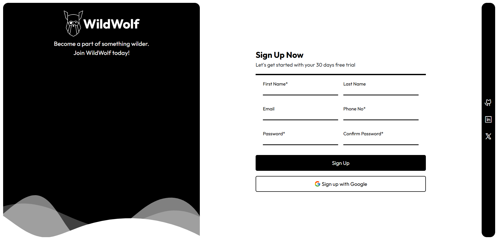

# 🐺 WildWolf Sign-Up Form

A responsive and modern sign-up form built with **HTML** and **CSS** — created as part of [The Odin Project](https://www.theodinproject.com/) Foundations curriculum.

This project focuses on form structure, layout design, input styling, and user-friendly visual feedback — wrapped in a sleek WildWolf brand theme. 🌑🐾

---

## 📂 Live Demo

🚀 [Check out the live version here](https://devxsameer.github.io/sign-up-form/)  
📦 [View the GitHub Repo](https://github.com/devxsameer/sign-up-form)

---

## 📸 Preview

---

## 🎯 Features

- ✨ Clean and responsive layout using modern CSS
- 🧾 Input fields for name, email, password
- ✅ Real-time form validation using HTML5 attributes
- 🔒 Password confirmation feedback
- 🧠 User-friendly design with visual focus states and error highlights
- 🌐 Responsive design — mobile friendly and desktop-ready

---

## 🛠 Tech Stack

- HTML5
- CSS3 (Flexbox layout)
- Optional: Google Fonts for typography
- No JavaScript — just pure frontend styling and structure!

---

## 📁 Project Objectives (From The Odin Project)

- Practice building a complete form from scratch
- Understand layout and input field styling
- Learn about validation, `:focus`, `:invalid`, and form UX
- Strengthen responsive design skills

---

## 🐾 Join the Pack

Building good forms is the foundation of great user experiences — and this one’s got a bit of WildWolf flavor on top. 🌕

#100DaysOfCode #TheOdinProject #HTML #CSS #Frontend #SignUpForm #WebDev #ResponsiveDesign #WildWolf
